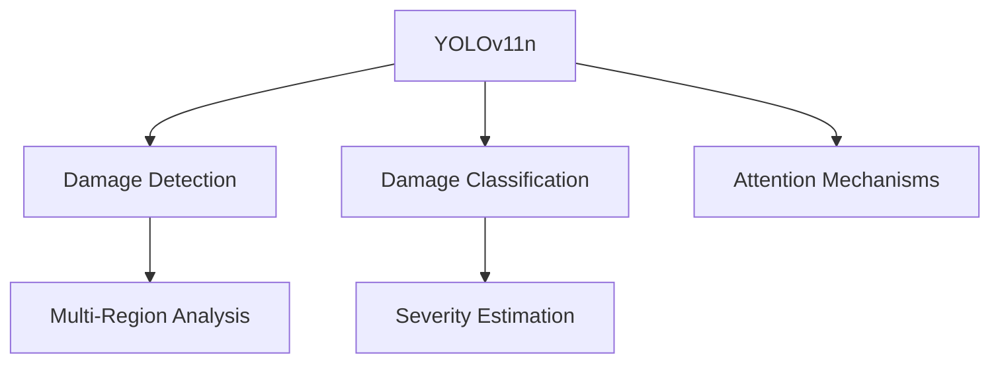

# Automated Vehicle Damage Inspection System Plan

## 1. Dataset Strategy

- **Primary Dataset**: [Roboflow Car Damage Dataset](https://universe.roboflow.com/shashidhar-patil/car-damage-dataset/dataset/15)
- **Augmentation**:
  - Roboflow-native transformations (45° rotation, ±20% brightness)
  - Synthetic damage generation using GANs
  - Weather/lighting variations (fog, night scenes)

## 2. Model Architecture



## 3. Technical Stack

| Component     | Technology Choices           |
| ------------- | ---------------------------- |
| Core CV       | PyTorch, Ultralytics YOLOv8  |
| Data Pipeline | Roboflow SDK, Albumentations |
| Backend API   | FastAPI, Redis (caching)     |
| GenAI         | LangChain, Claude-3 Opus     |
| Monitoring    | Prometheus, Grafana          |

## 4. System Components

### 4.1 Data Pipeline

```python
# Roboflow integration example
import roboflow
from roboflow import Roboflow

rf = Roboflow(api_key="YOUR_API_KEY")
project = rf.workspace("shashidhar-patil").project("car-damage-dataset")
dataset = project.version(15).download("yolov8")
```

### 4.2 API Endpoints

```json
{
  "/inspect": {
    "methods": ["POST"],
    "params": {
      "image": "File upload",
      "vehicle_type": "sedan/truck/motorcycle"
    }
  },
  "/report": {
    "methods": ["GET"],
    "params": {
      "inspection_id": "UUID"
    }
  }
}
```

## 5. Validation Framework

| Metric                 | Target | Tools              |
| ---------------------- | ------ | ------------------ |
| mAP@0.5                | ≥0.85  | Roboflow Benchmark |
| Damage Recall          | ≥0.90  | Confusion Matrix   |
| Report Generation Time | <2s    | Locust             |

## 6. Directory Structure

```
project-root/
├── data/
│   ├── raw/
│   ├── processed/
│   └── synthetic/
├── models/
│   ├── yolov8/
│   └── gan_augmenter/
├── api/
│   ├── app.py
│   └── requirements.txt
└── docs/
    └── inspection-protocols.md
```

## 7. Next Steps

1. Dataset preprocessing and class balancing
2. YOLOv8 base model fine-tuning
3. API endpoint scaffolding
4. GenAI prompt engineering
