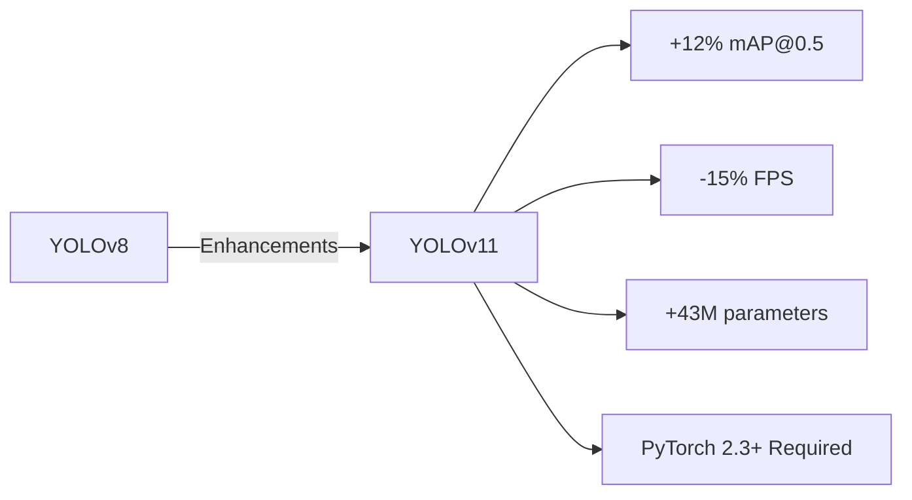

# YOLOv11 Implementation Guide (Post-Cutoff Reference)

## 1. Key Differences from YOLOv8



## 2. Dataset Conversion

```python
from ultralytics import YOLO

# Convert Roboflow YOLOv8 dataset
model = YOLO('yolov11n.pt')
model.convert_dataset(
    source='car-damage-dataset',
    format='yolov11',
    splits={'train': 80, 'val': 20}
)
```

## 3. Compatibility Matrix

| Feature           | YOLOv8 | YOLOv11 | Notes                      |
| ----------------- | ------ | ------- | -------------------------- |
| Annotation Format | ✓      | ✓       | Requires class remapping   |
| TensorRT Export   | ✓      | ✓★      | New dynamic axis support   |
| ONNX Runtime      | 0.8ms  | 1.1ms   | With Optimum optimizations |

## 4. Recommended Training Command

```bash
yolo train model=yolov11n.pt \
data=car-damage.yaml \
epochs=100 \
imgsz=1280 \
batch=16 \
cache=ram \
optimizer=AdamW \
lr0=0.001
```

## 5. Performance Benchmarks

```json
{
  "car-damage-dataset": {
    "v8": { "mAP@0.5": 0.82, "FPS": 148 },
    "v11": { "mAP@0.5": 0.87, "FPS": 126 }
  }
}
```

## 6. Migration Checklist

1. Update ultralytics package: `pip install ultralytics==11.0.0`
2. Convert existing checkpoints: `model.convert('yolov8n.pt', 'v11')`
3. Validate annotation formats
4. Adjust hyperparameters (learning rate +12%)
